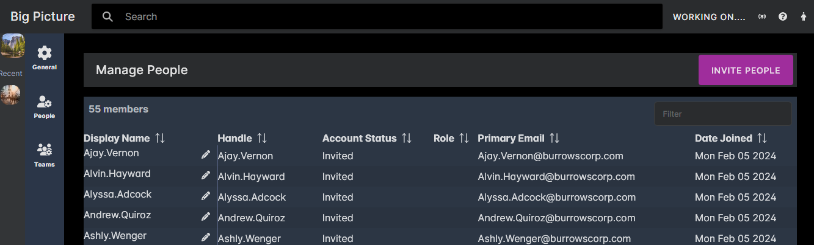

As we continue down the development path of Big Picture, I think it will be a good practice to post weekly progress updates, a "stand-up" as it were. It will help me look back and see the decisions and progress that I make week to week, and it will help show different aspects of the project as it gets more and more mature. 

I don't really know how long it will take to get to an MVP for Big Picture. But, in my head, I have September as a goal. I'm not sure how realistic that is. On some days I wake up thinking there is no way I could make that. Other days I feel like I will have an MVP version done long before that.

September or not, though, these stand-up posts will help chart the progress as I work.

The below updates constitute more than a week's worth of work. These recent changes probably represent closer to 2-3 weeks worth of work. I've been working on this project for a couple months now (since the first of December, really), so there are a lot of technical decisions already made that I've not covered in blog posts. But since this is the first "stand-up" post, there is more to cover this week than there will be in future weeks.

<!--truncate-->

## What Did You Work on This Week?

### UI Updates

#### Tasks Roll-Up Screen

Prior to an MVP, my first goal is to get to the point where I can "[dog food](https://en.wikipedia.org/wiki/Eating_your_own_dog_food)" the product myself: using it to track the work that needs to be done and how close I am to being done. 

This week let me see a big step toward that goal. I was able to create a good task "roll up" screen that shows the tasks, description, priority, status, and other details.

This screen is inspired by Microsoft Teams' (terrible) Channel view, where posts are shown as cards and topics with the replies to the posts summarized. It is a very unnatural way to view conversations in MS Teams, giving a single post far more weight than it really deserves. But what is bad for a conversation, I think is going to be a very easy and natural for tasks.

There will be other ways to view lists of tasks within Big Picture, of course, but I am hoping the roll-up view becomes a popular and well-liked view.

I spent some time on the create task screen, but only enough to create a rudimentary task. You can enter title and description for now. In the coming weeks I will improve this functionality.

#### People and Teams

My goal this month (through mid-March) is to get creating and viewing tasks working sufficiently. But along the way, I need to digress occasionally to build pieces that are building blocks for what I am working on. People and Teams are two of those features. 

You can't assign someone to a task unless there is a list of "someones" somewhere. So these are the first versions of People and Teams screens:

The people screen is just a list of people right now with their handles pulled from their email addresses. There is an "epic" planned for later to flesh out people functionality including editing profiles and setting permissions. But for now, it is a quick way to invite a bunch of users (all fake email addresses in the screenshot) so that I can assign them tasks.

The teams lists is not too different from the people list. 

I spent more time on the create team dialog, so that uploading a custom avatar for a team works (files are stored in Google Cloud Storage buckets, with a unique bucket being created for each tenant -- more on that feature in the coming months.)

I also spent an unreasonable amount of time creating a color picker dialog that works with the theme colors for the site:

### Backend Updates

I haven't talked much about the backend, or even the tech stack, yet in this blog. I'll dedicate a full post to going over this in more detail. But at a high-level: it is microservice based, written in C#; using PostgreSql for the data store; RabbitMQ for message transport; and [Wolverine](https://wolverine.netlify.app/) and [MartenDb](https://martendb.io/) for message bus and event store, respectively.

The backend changes this week were mostly API endpoints to support the task list screen, with only a few new events being published (mostly update task events: TaskDetailsUpdated, TaskAssignmentUpdated, etc...).

The other major new feature for the backend was the file upload to GCS. Integrating with the GCS API, and setting up streaming of files from the UI -> gateway -> Files microservice -> GCS all without ever storing the full file in memory took some time.

## What Will You Work on Next Week?

I hope to get more tasks functionality working. I want to get full editing of the tasks working, with all task details being editable. This does not include conversations for tasks. Right now, in the screenshots, all the conversation stuff is just placeholders, and it will continue to be placeholders until I get to the conversations epic (which I plan to start in mid-March).

I also want to get creating sub-tasks working, so that parent ↔ child relationships in tasks can be viewed.

And then, finally, I want to add more functionality to the tasks roll-up screen. Maybe add more of a collapsed view, and a natural way to display sub-tasks.

I can't believe you made it all the way to the end of this post! You should definitely enter your email and sign up for updates if you haven't already. 
