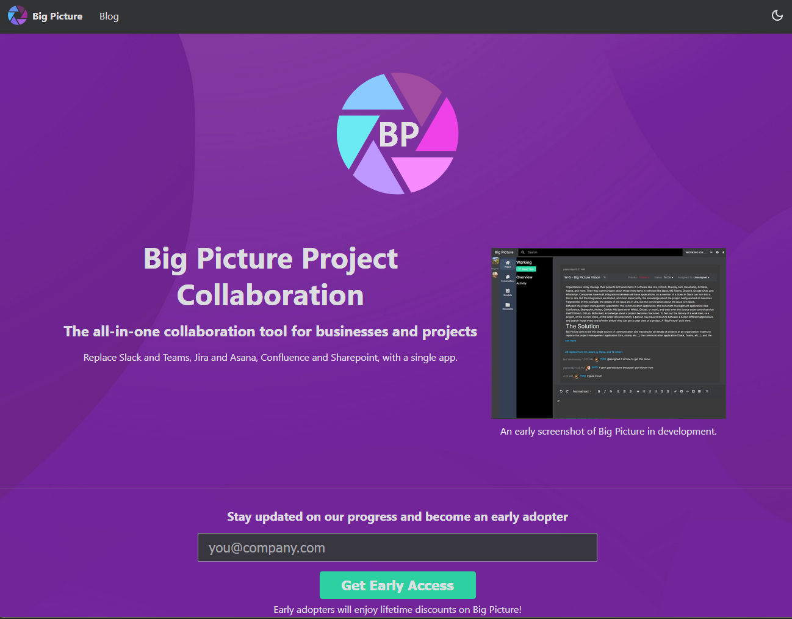
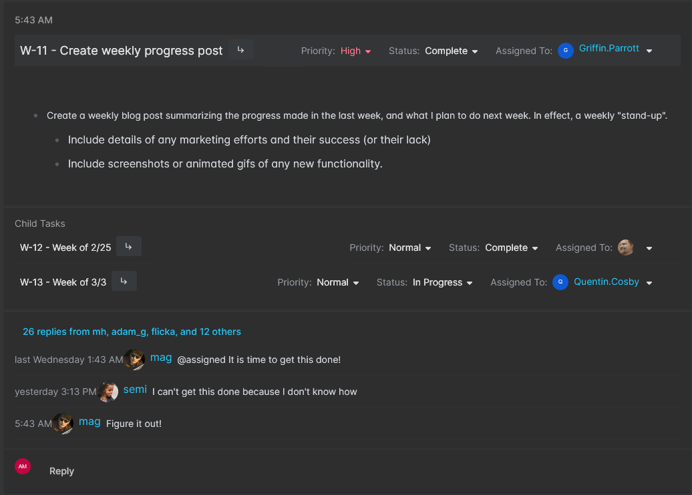
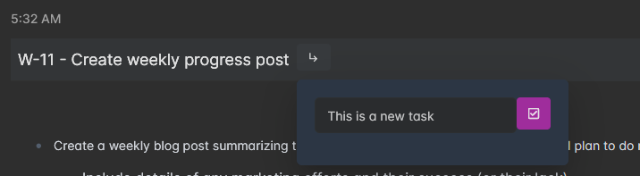
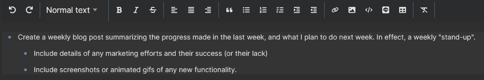
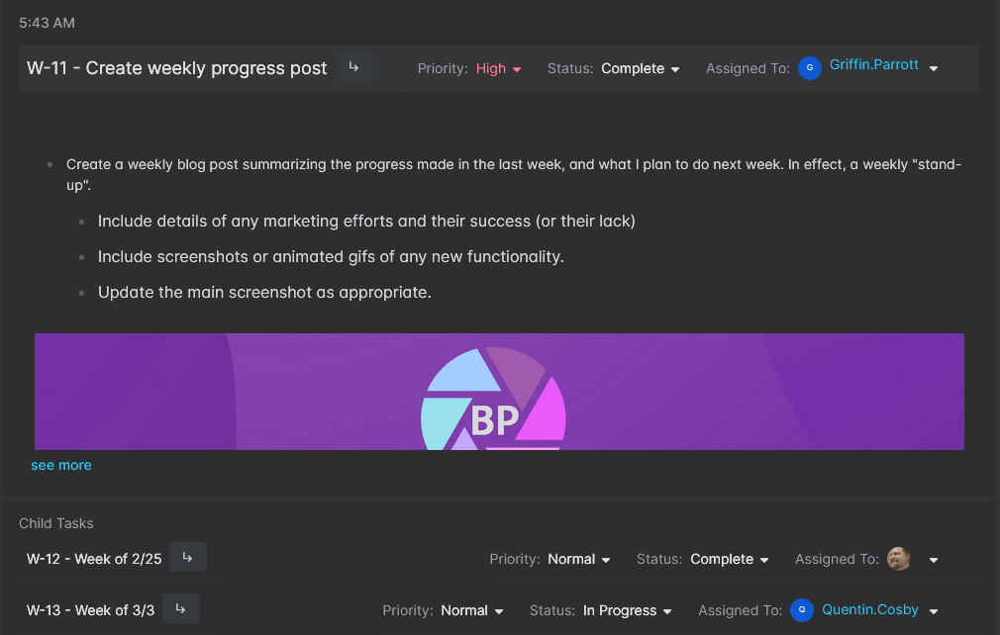
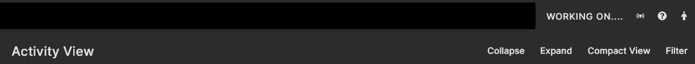

This week was a lot of positive progress. No major technical issues came up that impeded my work (until the end with the markdown editor, but I'll get to that in a bit). I am waking up consistently at 4am every day, and most days I am able to work until 7 or 7:30am before I have to switch off to do paying work, or family obligations, or other things. Being able to get enough time to actually put toward this project is a big concern for me. Staying motivated to continue to work on it, and being able to fit in the time to work on it.

<!--truncate-->

## What Did You Do This Week?

### Landing Page Feedback

This week I showed the landing page to people on the IndieHackers group and asked for feedback. Some of it was good feedback, some of it wasn't, and some of it missed the mark. It reminds me of writing workshops where, ultimately, whether or not to take a bit of feedback is up to you. For most of it I'll have to gradually improve as I develop this application. 

For instance, one of the complaints was too much text (what? is that possible?! lol), which is probably true. But I don't yet have a lot of images or screenshots to replace that text with. Since this is a work in progress, I'll gradually add additional screenshots as I work on them.

I think the biggest, most consistent, issue was the big logo in the middle:

Reviewers, rightly, said that it was too big, and took too much attention for being non-functional. I see the point and agree. The simplest fix is to just remove the logo from that spot completely. Who cares about my logo, anyway.

Another complaint was that the call-to-action (Get Early Access) was too far down the page. It needs to be "above the fold." I can only guess they were looking at this webpage on one of those foldable phones, this isn't a newspaper, there is no fold! ...I kid. As you can see from the screenshot above, on my monitor at least, the call-to-action IS above the fold. Getting rid of the big logo will move it up the page, though, which means the fix for the first two issues is the same! That always feels like a programming win.

Another legitimate issue is that changing the theme to the light theme has some color problems. It certainly does! Not sure what kind of mad person chooses the light theme, but I definitely need to fix that.

Some people complained about the screenshot not looking "polished", but for me, that is a feature, not an issue. Every week I plan on updating the screenshot, and hopefully each week it will get better and better. (This person didn't even see the FIRST screenshot, they would have been appalled!)

Someone mentioned that I need social proof. Not sure how to get that right now, since the product isn't usable yet. Maybe I could put a bunch of logos up of companies that I think would love to use this product? 

I think that was the main feedback, which all-in-all is pretty good. Some other feedback was about tightening up and improving the language, and explaining better what this application does. I agree with that too. You can always get better with those things.

#### Landing Page Purpose

I think it is important to note that right now, six to nine months out from even considering having a single adopter, my main goal with the landing page is to just get a couple people who would be willing to be those first adopters. I want someone willing to be the guinea pig and actually be the first company to try the application. To that end, having a landing page which is slightly unpolished, and still gets someone intrigued enough to want to try the application is a good thing. 

Getting people to want to try Big Picture is going to be far, far, far harder than actually writing the software. Which is why I am spending time on "marketing" now. Writing these blog posts is a minimum, I plan on doing additional work in this area in the coming weeks and months. 

### Editing Tasks and Subtasks

The main functionality progress this week is the ability to edit all the fields displayed on the task summary screen.

Everything in the above screenshot is editable: priority, status, assignments, main description, and subtasks. The conversation section is not editable yet, and that is all mock data right now. I plan to start the conversations "epic" in mid-March.

You can add subtasks quickly right from this screen by clicking the subtask button next to the task title and filling in the popup form:

A lot of effort went into the editor (I am using [Milkdown](https://milkdown.dev/) as the markdown editor), to get it displaying correctly with reasonable fonts and spacing and to size appropriately in all the screens where it is displayed. This editor is also displayed on the main new task page and in the add new message section on the bottom of the screen.

I don't feel like this work is anywhere near done, though. There is a lot more functionality I want to get working in this editor (@mentions, #tags, /commands, and :emojis) and I was disappointed by how difficult this was (even though Milkdown shows this functionality on their demo page), and how much code it is going to take to make it work. I am going to have to create an entire "epic" dedicated to just making this work. It will probably be a week of effort all by itself.

But for now, basic editing is working, and you can type text just fine. You can even paste screenshots into the editor:

Though, the screenshots are being saved embedded with the markdown text instead of being uploaded to the GCS file storage and being given a separate file ID. This is a fine compromise for the moment, but it is something I will need to work on as part of the "Milkdown Editor" epic.

## What Will You Work on Next Week?

I have two more weeks planned for the "tasks" epic, before I move on to the conversations epic. In the screenshots above, wherever you see conversation messages, those are all just dummy data and most of the conversation functionality does not work yet. Conversations will require me to implement websockets through my infrastructure. That week's blog post will likely be far more technical in nature and not have quite so many screenshots :smile:.

But that is a couple weeks out, yet. Next week I want to add some overall functionality to the activity view page. Right now I have this UI as placeholders:

Where the "collapse," "expand," "compact view", and "filter" buttons don't actually do anything yet. Currently this page shows a task with all their details. I want the collapse button to hide subtasks and comments. I want the compact view to hide descriptions. And I want the filter button to let people quickly find a specific issue, or show only items with certain priorities, assignments, or statuses. I might also play around with sort options in here. Currently everything is sorted by last modified date, but sorting by created date, or priority might be useful with certain filters.

The other thing I want to get finished next week is the task detail view. The screenshots above all just show the summary view which eliminates some fields (it only shows one assignment field for instance), doesn't display custom fields, and doesn't actually let you edit a title (which I may need to change in the future, perhaps with a dedicated button.) Currently clicking on a title navigates to the detail view. I don't anticipate the detail view being a lot of work (famous last words, I know.) It is mostly the same functionality as this summary view, but with some additional action options (like clone.)

Thanks for reading! And again, if you've actually read this far and aren't signed-up for updates from the mailing list, you really should.
