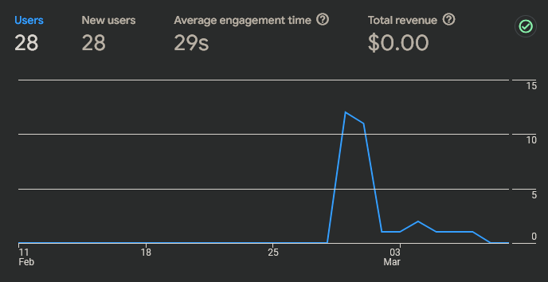
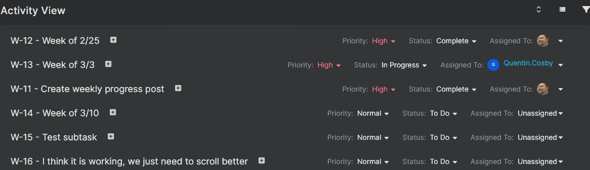
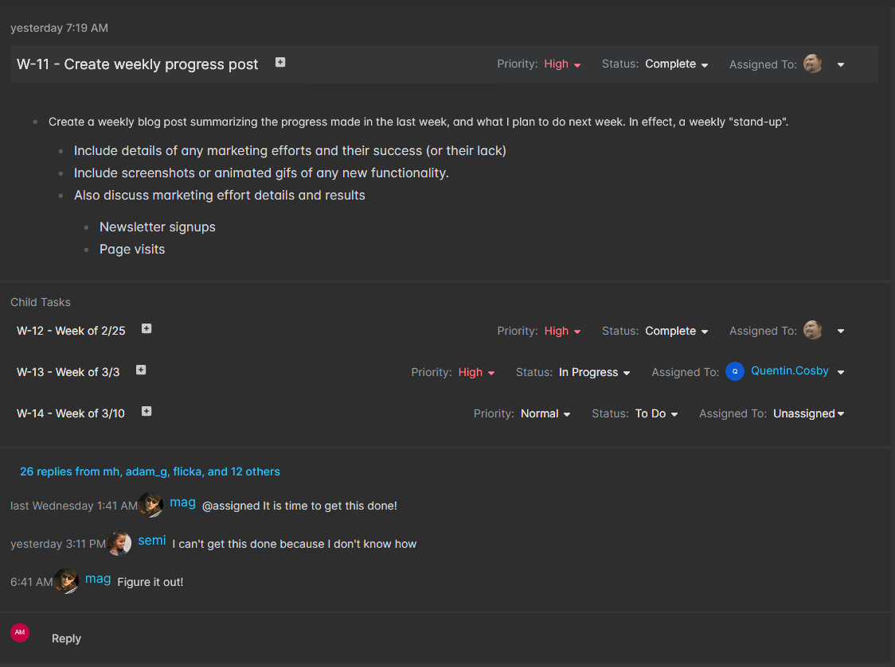
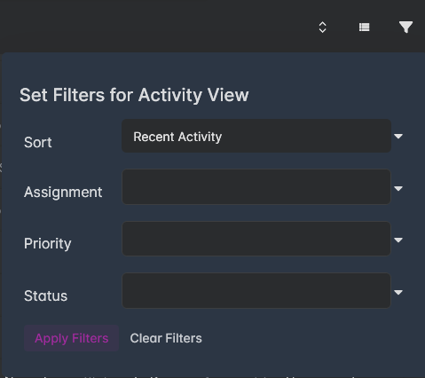
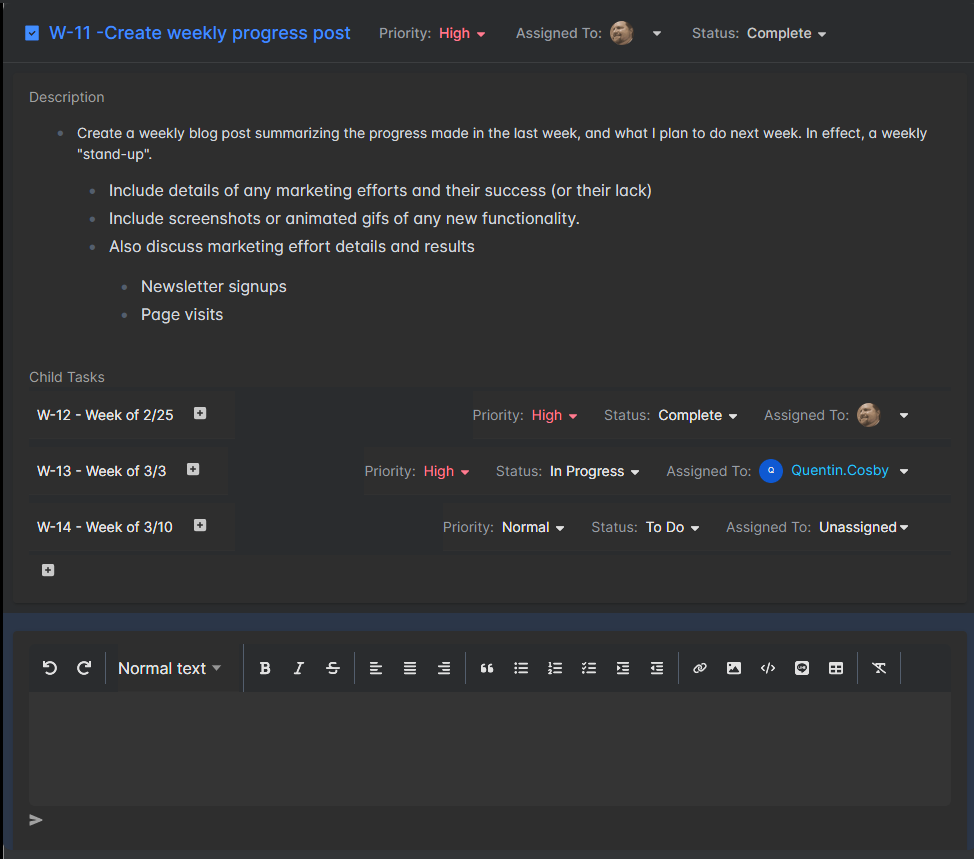

I feel like I wasted (squandered, blew) part of this week, yet I still managed to accomplish my goals. I need to be less judgemental about myself. Everything I had planned to do was finished, and I also worked on an idea for a newsletter (more on that below.) I also woke up "late" a couple days (5:30 instead of 4:30) and right now, the day where we welcome daylight savings time back into our lives, I am sitting down and writing at 6:20 in the morning. Very late, indeed! But it is all ok. I can't even tell myself that "setbacks are ok, they are bound to happen," because there were no setbacks! So why do I feel that I could have been more productive this week? Perhaps I could, though I try to reject this "productivity culture" that hurts America, the thoughts still seep in.

## What Did You Do This Week?

### Newsletter Idea

I had the idea of starting a weekly newsletter on SubStack that rounded up relevant articles and stories, things I read anyway, and published them out with small summaries. A Big Picture newsletter that covers topics such as product and project management, leadership, management, entrepreneurship, and organizational psychology. There are a number of these sorts of newsletters out there already, but I think as evidenced by me starting a project management application, I am not afraid of a crowded marketplace. In my opinion, a crowded marketplace only means that the idea is proven out and everyone is making money! 

But the newsletter won't work without some amount of automation. More than just an RSS reader, and more than just AI summaries (which I don't want to use, though I will use AI categorization.) The problem with a newsletter is that it can quickly grow to fill your entire day, constant tweaking and fixing, reading, and sorting. I've done this sort of thing before. My goal is to time-box it. Once I get enough things written such that I can produce a newsletter, I want to allow myself only two hours per week (probably divided up across a couple days) to do the whole thing. I don't have to be precious about each issue.

Why a newwsletter? Mostly for readership and backlinks. I want to use it as a way to get word of Big Picture out. It isn't going to be a commercial for Big Picture, of course, but each issue will link to Big Picture and mention that the newsletter is sponsored by Big Picture, and include a little blurb. As it stands, my google analytics and website traffic are close to nothing:

With 28 users and an average engagement time of 29 seconds, I can guarantee not a single person has even read one of these blog posts! Nothing makes you feel more like you are talking into the void than Google Analytics.

My hope is that a newsletter will get more traffic to the site, and hopefully some people to sign up for the trial when we are ready. I'd love to be able to talk with some interested prospective customers.

### Activity View Progress

I got the collapsed view of the activity view working this week. You can collapse a task card down to just a single row as seen in the screenshot above.

Here is what a task card looks like expanded to its full glory:

By being able to collapse, a user can quickly scan and view specific tasks, and then click into them to view the details.

On a similar token, the filter dialog lets you sort by Recent Activity or Priority. I was going to add sorting by Task Status (which I definitely want to add in the future), but it wound up being technically too challenging right now. I can come back to that later when I have some dedicated time.

And more than sorting, you can also filter by assignment (which will filter by ALL assignment fields on a task), priority, or status. Hopefully these tools will let people quickly find the task they are looking for.

### View Task Progress

I also got a functional version of the View Task screen working this week.

The layout is similar (though slightly different, and slightly more detailed) to the Activity View task cards, but has some additional features and actions. This screen is far from "done", but it is functional right now. I imagine this screen and the Activity View screen will be a constant target of enhancements and additional features. 

## What Will You Work on Next Week?

This week is my last planned week of the "tasks" epic, and I think it comes at a good time. The task screens are functional right now and spending one more week working on them will allow me to add convenience features and some nice-to-have items before I move onto the "conversations" epic (which will also effect these screens.)

This week I want to add some task actions (like cloning or linking), I want to get subtasks displaying better (right now you can have deeply nested subtasks that are hard to find), and maybe individual task expansion on the activity view screen. Some of the subtask stuff will get fixed when I get to the "navigation" epic, too. Right now the sidebar navigation in the app is minimal and not fully fleshed out. But I needed to be able to add content before I can get the nav working. The search feature will also improve the subtask discovery. So much exciting stuff to do.

Another thing I want to try and work on this week is a public "roadmap" that shows the features and epics I have planned and when I plan on getting to them. I am keeping track of them myself, of course, but if I am "building in public" it would be nice to publish my roadmap too.

Thanks for reading! And like always, if you've actually read this far (which the analytics screenshot above proves that you haven't) and aren't signed-up for updates from the mailing list, you really should.
